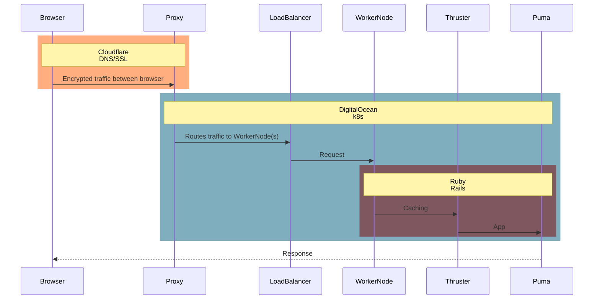

# README

The app currently doesn't do anything.

1. new Rails 8 app

- `rails new --css=tailwind --devcontainer`

2. upgraded to Tailwind v4 beta

- see [application.tailwind.css](/app/assets/stylesheets/application.tailwind.css)

3. setup actions

- see [publish.yml](/.github/workflows/publish.yml)
- see [deploy.yml](/.github/workflows/deploy.yml)
- see [packages](/pkgs/container/eatbreakfast.club)

4. registered domain through Cloudflare

- includes SSL, CDN, caching, etc.

5. hosted on DigitalOcean Kubernetes (DOKS)

- see [load_balancer.yml](/config/kube/load_balancer.yml)
- see [deployment.yml](/config/kube/deployment.yml)
- runs `kubectl rollout restart deployment/eatbreakfast-club-deployment`

## Other commands

- after making production infrastructure changes
  - `kubectl apply -f config/kube`
- open production rails console
  - `kubectl exec -it deployment/eatbreakfast-club-deployment -- bin/rails c`
- open production shell
  - `kubectl exec -it deployment/eatbreakfast-club-deployment -- /bin/bash`
- tail logs
  - `kubectl logs -f deployment/eatbreakfast-club-deployment`

## Diagram

